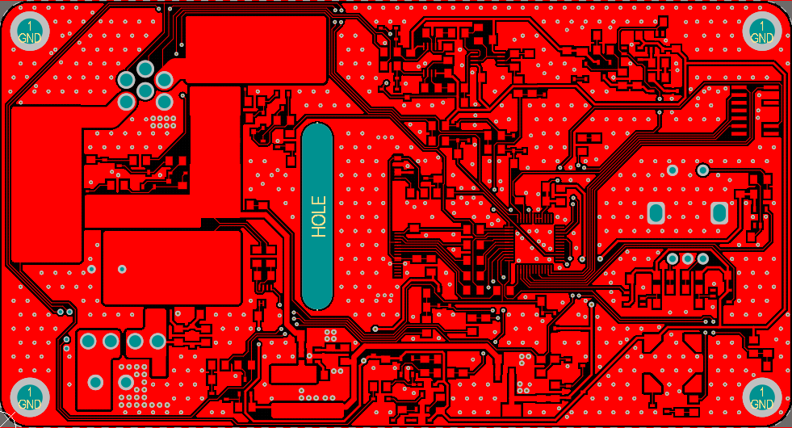
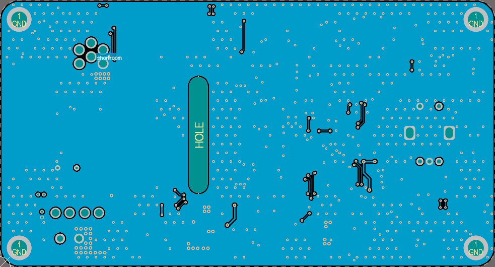

# battery-soldering-iron-controller
Industrial display design with very good readability even for a user at a considerable distance.  The display is built with 16 8x8 pixel matrix indicators with dimensions of 32x32mm.  For each indicator there is a dedicated MAX7219 controller. The controllers are connected in cascade, making control of the entire display possible using a single SPI line (MOSI, SCK, CS).  The designed display has dimensions of 250mm by 64mm. The operation of the designed device is controlled by a PIC32MX470 microcontroller. The PCB design was created in Altium Designer. The software was written in C using the MPLABX IDE development environment. 

